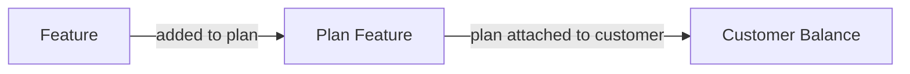

Balances determine what features a customer can use, and track how much they have used. 

Balances are created in two ways:

1. **Automatically from plans**: When a plan is attached to a customer, each feature in the plan becomes a balance for that customer.
2. **Standalone via API**: You can create balances directly using the API, independent of any plan. See [Managing Balances](/documentation/customers/managing-balances) for details.



Customers can also [Stack Balances](/documentation/customers/balance-stacking) of the same feature from multiple plans (eg, an add-on plan), or different reset intervals (eg, monthly credits and one-time top-ups).


## Core Fields

Each balance has the following key fields:

| Field | Description |
|-------|-------------|
| `included_usage` | The amount granted by the plan, or a purchased quantity |
| `balance` | The remaining amount available |
| `usage` | The amount that has been consumed |

When you retrieve a customer, their balances will be included in the response. 

<Tip>
For the complete balance schema including reset configuration, overage settings, and breakdown details, see the [Get Customer API reference](/api-reference/customers/get-customer).
</Tip>

<Expandable title="example customer response">
```json
{
  "balances": {
    "messages": {
      "granted_balance": 1000,
      "current_balance": 750,
      "usage": 250,
      "unlimited": false,
      "reset": {
        "interval": "month",
        "resets_at": 1745193600000
      }
    },
    "premium-support": {
      "unlimited": true
    }
  }
}
```
</Expandable>

## Feature Types and Balances

When you create a feature, you define its type. This affects how balances behave.

### Consumable Features

Features that are used up and can be replenished. Examples: credits, API requests, AI tokens.

Consumable features support **reset intervals** - the balance resets to the granted amount on a regular schedule.

Available reset intervals:
- `hour`, `day`, `week`, `month`, `quarter`, `semi_annual`, `year`
- `one_off` - the balance never resets (useful for one-time grants or top-ups)

### Non-Consumable Features

Features with persistent, continuous usage. Examples: seats, workspaces, storage.

Non-consumable features don't reset. Instead, they support **proration** when quantities change mid-billing cycle.

### Credit Systems

A [credit system](/documentation/pricing/credits) lets multiple features draw from a single shared balance.

When you check or track usage, you use the underlying feature ID (e.g., `premium_message`), but the balance is deducted from the credit system.

When you track usage for a feature in a credit system, Autumn:
1. Looks up the credit cost for that feature that you defined
2. Multiplies the usage value by the credit cost
3. Deducts from the credit system balance

For example, if you have a credit system with a credit cost of 2 credits per API request, and a customer uses 10 API requests, Autumn will deduct 20 credits from the balance.


## Positive and Negative Balances

A balance can be positive or negative:

- **Positive balance**: Customer has unused allowance remaining
- **Negative balance**: Customer has used more than their allowance (only possible if [overage](/documentation/pricing/plan-features#priced-features) is enabled)

<Note>
Features can only have a negative balance if they have a usage-based price that allows overage. Otherwise, tracking stops when balance reaches 0.
</Note>

