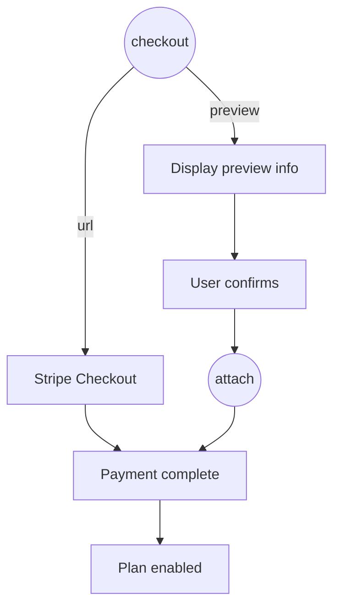

Accepting payments is a two-step process:

1. **`checkout`** - Gets checkout information (either a Stripe Checkout URL or purchase confirmation data)
2. **`attach`** - Enables the product and charges a saved payment method



## Checkout

Call `checkout` when a customer wants to purchase a product. If no payment method is on file, a Stripe Checkout URL is returned. Otherwise, preview data (prices, proration info) is returned for the customer to confirm.

<CodeGroup>

```tsx React
import { useCustomer, CheckoutDialog } from "autumn-js/react";

const { checkout } = useCustomer();

<Button onClick={() => checkout({ productId: "pro", dialog: CheckoutDialog })} />
```

```typescript Node.js
import { Autumn } from "autumn-js";

const autumn = new Autumn({ secretKey: "am_sk_..." });

const { data } = await autumn.checkout({
  customer_id: "user_123",
  product_id: "pro",
});

if (data.url) {
  // Redirect to Stripe Checkout
} else {
  // Show confirmation UI with preview data
}
```

```python Python
from autumn import Autumn

autumn = Autumn("am_sk_...")

response = await autumn.checkout(
    customer_id="user_123",
    product_id="pro",
)

if response.url:
    # Redirect to Stripe Checkout
else:
    # Show confirmation UI with preview data
```

```bash cURL
curl -X POST 'https://api.useautumn.com/v1/checkout' \
  -H 'Authorization: Bearer am_sk_...' \
  -H 'Content-Type: application/json' \
  -d '{
    "customer_id": "user_123",
    "product_id": "pro"
  }'
```

</CodeGroup>

## Attach

If `checkout` returned preview data (no URL), call `attach` after the customer confirms to charge their saved payment method and enable the product.

<CodeGroup>

```tsx React
import { useCustomer } from "autumn-js/react";

const { attach } = useCustomer();

<Button onClick={() => attach({ productId: "pro" })} />
```

```typescript Node.js
const { data } = await autumn.attach({
  customer_id: "user_123",
  product_id: "pro",
});
```

```python Python
response = await autumn.attach(
    customer_id="user_123",
    product_id="pro",
)
```

```bash cURL
curl -X POST 'https://api.useautumn.com/v1/attach' \
  -H 'Authorization: Bearer am_sk_...' \
  -H 'Content-Type: application/json' \
  -d '{
    "customer_id": "user_123",
    "product_id": "pro"
  }'
```

</CodeGroup>

## 3DS and Payment Failures

When calling `attach`, the payment may require additional action. Autumn will return:

| Code | Description |
|------|-------------|
| `3ds_required` | Payment requires 3D Secure authentication |
| `payment_failed` | Payment was declined (e.g., insufficient funds) |

Both cases include an invoice URL. Direct the customer to this URL to complete authentication or update their payment method. Once resolved, the payment processes and the subscription activates.

## Past Due Subscriptions

If a recurring payment fails (e.g., card expired), the subscription status becomes `past_due`. To resolve this:

1. Direct the customer to the [billing portal](/api-reference/customers/open-billing-portal) to update their payment method
2. Once updated, Stripe will automatically retry the failed invoice

<CodeGroup>

```tsx React
import { useCustomer } from "autumn-js/react";

const { openBillingPortal } = useCustomer();

<Button onClick={() => openBillingPortal({ returnUrl: window.location.href })} />
```

```typescript Node.js
const { data } = await autumn.customers.billingPortal("user_123", {
  return_url: "https://your-app.com/billing",
});
// Redirect to data.url
```

```python Python
response = await autumn.customers.billing_portal(
    "user_123",
    return_url="https://your-app.com/billing",
)
# Redirect to response.url
```

</CodeGroup>

<Note>
If you'd like to block feature access when a subscription is `past_due`, please contact us. We can enable a configuration flag to do this for you.
</Note>
