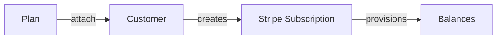

Autumn uses Stripe subscriptions under the hood to handle recurring billing. When you attach a plan to a customer, Autumn creates the Stripe subscription and provisions feature balances automatically.

When a subscription is created, Autumn provisions [balances](/documentation/customers/balances) for each feature in the plan. Balances determine what the customer can access and track how much they've used. For example, a Pro plan might grant 1,000 API requests per month—this becomes a balance that decrements as the customer uses your product.

Balances can also be created for [credit systems](/documentation/pricing/credits) (eg, $10 credits per month) and boolean toggle features (eg, access to a premium analytics dashboard). 

## Subscription statuses

| Status | Description |
|--------|-------------|
| `active` | Subscription is in good standing |
| `trialing` | Customer is in a free trial period |
| `past_due` | Payment failed, subscription needs attention |
| `scheduled` | Product will activate at end of current billing period |
| `expired` | Subscription has ended |

<CardGroup cols={2}>
  <Card title="Accepting Payments" icon="credit-card" href="/documentation/subscriptions/accepting-payments">
    Learn about the checkout and payment flow
  </Card>
  <Card title="Managing Subscriptions" icon="sliders" href="/documentation/subscriptions/managing-subscriptions">
    Handle upgrades, downgrades and cancellations
  </Card>
</CardGroup>
