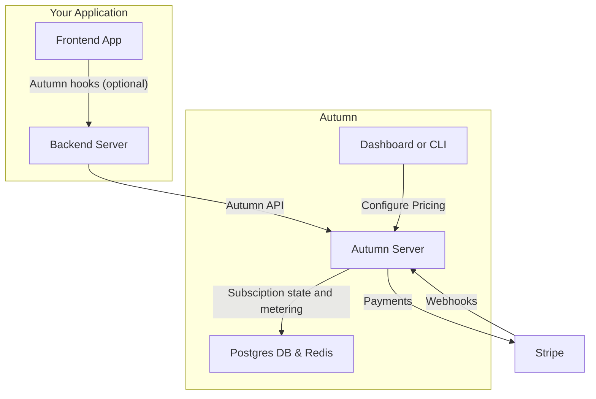

## What is Autumn?

Autumn handles your billing flows and makes sure your customers have the access to the right features and limits. 

It sits between your server and Stripe billing, and acts as your managed database for subscription status, usage metering and credit balances.

1000s of founders and fast-growing startups use Autumn to make billing easier and more reliable. No webhooks needed!

## How it works

<Steps>
<Step title="Model your pricing in Autumn">
Model your pricing plans in the Autumn UI, or through a config file. Define your free, paid and any add-on pricing tiers.

A typical billing provider (eg, Stripe) would let you configure your pricing -- then send you webhooks to handle the rest. In Autumn, you define _both pricing and the features that customers get access to_.

You can link features to these plans and define their usage limits: both recurring (monthly, yearly) and one-time grants.
</Step>
<Step title="Handle payments">
The `checkout` function will return a Stripe checkout URL, or confirmation data for an upgrade/downgrade for the plans you defined in step 1.

Once paid, the Autumn will grant access to the features on their plan.

</Step>

<Step title="Check permissions and limits">
When a customer tries to do something (eg, use a credit), [check](/documentation/customers/check) in real-time whether they're allowed to. 

If the user has access to the feature on their plan, and hasn't exceeded their usage limit, they will be allowed to do it.

</Step>

<Step title="Track usage">
If Autumn tells you they're `allowed` access, let them use the feature. Afterwards, you can [track the usage](/documentation/customers/tracking-usage) to update their balance, or bill them for any usage-pricing.

</Step>
</Steps>

Autumn also provides APIs to easily get customer billing data (to display on a billing page), open Stripe billing portal, display usage analytics, handle org billing, setup referral programs and more.

## Why use Autumn?

Reliable billing is hard to setup and maintain. When integrating Stripe directly, you are responsible for:

- **Syncing subscription state**: active, overdue payments, cancelling, 5-10 webhooks
- **Plan switching**: upgrades, scheduled downgrades, add ons
- **Usage limits**: monthly recurring limits, one-time limits, spend limits, credits
- **Custom plans**: and plan versioning, pricing migrations

The problem gets worse as your codebase and pricing changes. Billing code becomes a sprawling mess of edge cases, race conditions and takes time away from building your product.

Autumn is a managed service that replaces this logic. Your server makes queries to Autumn, and it tells you if a customer can "do something" (eg, send a chatbot message, access premium features, etc), based on your pricing plan configuration.

This gives you flexibility to make pricing changes, or define custom plans for important customers without touching any code.

## What Autumn is not

- **A Stripe billing replacement**: although you don't need to deal with Stripe's APIs, you are still using (and paying for) Stripe's subscriptions, payments and invoicing. You bring your own Stripe account and are never "locked in" to our system.

<Card
  title="Join us on Discord"
  icon="discord"
  href="https://discord.gg/STqxY92zuS"
>
  Connect with us, other users, and get integration support within minutes --
  we're always online (if we're awake)
</Card>
